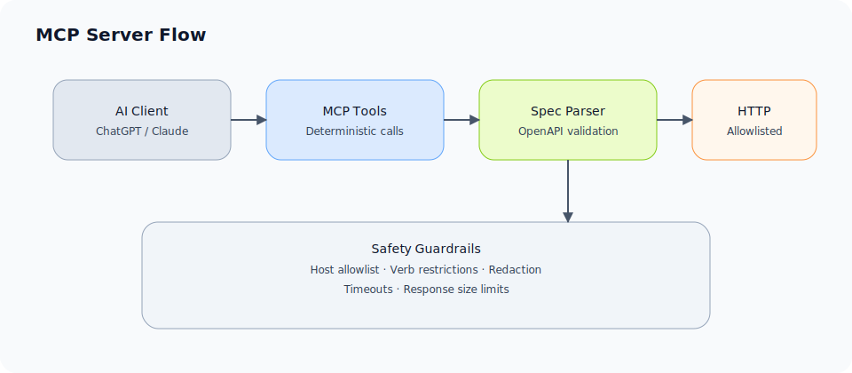

# dotnet-mcp-api-tester

A **Model Context Protocol (MCP) server** that turns any **OpenAPI (Swagger) specification** into **safe, deterministic tools** that AI clients (ChatGPT, Claude, internal LLMs) can use to **document, test, and analyse APIs**.

This project is **model-agnostic**.  
It does not embed or depend on any AI model.

---

## What this is

- A .NET 8 MCP server
- Reads OpenAPI v3 (Swagger) specifications
- Exposes API operations as **safe, structured tools**
- Enables AI clients to:
  - list endpoints
  - call endpoints deterministically
  - run baseline API tests
  - generate documentation
  - detect contract drift
  - flag basic security issues

The AI reasons.  
This server executes.

---

## What this is NOT

- ❌ Not an AI model
- ❌ Not a Swagger UI replacement
- ❌ Not a fuzzing or pentesting tool
- ❌ Not a magic “AI guesses your API” product

This tool is **contract-first** and **deterministic by design**.

---

## Why this exists

Most API tooling today suffers from the same problems:

- Swagger docs drift from reality
- Postman collections rot
- Contract tests are manual and brittle
- Security scanners are noisy
- AI tools guess and hallucinate

This project uses **OpenAPI as ground truth** and MCP as the execution boundary, so AI clients can work safely without guessing.

---

## How it works

1. You provide an OpenAPI (Swagger) spec
2. The MCP server parses and validates it
3. Each operation becomes a callable tool
4. AI clients use those tools to:
   - test endpoints
   - inspect behaviour
   - generate documentation
   - analyse mismatches

The server enforces:
- host allowlisting
- safe HTTP verbs by default
- output redaction
- timeouts and size limits

---

## Architecture overview

AI Client (ChatGPT / Claude / Internal LLM)  
↓ MCP  
dotnet-mcp-api-tester  
↓ HTTP (strictly controlled)  
Your API

The AI never talks to your API directly.



---

## Current status

**Day 1**
- MCP server running over stdio
- Tool discovery working
- Local execution validated

**In progress**
- OpenAPI import and parsing
- Operation listing
- Deterministic API execution

---

## Planned tools (v1)

- `api.import_openapi(specUrlOrPath)`
- `api.list_operations()`
- `api.call(operationId, params, body)`
- `api.test_all()`
- `api.generate_docs()`

All tools return **structured JSON**.

---

## Security stance

This project is **secure by default**:

- Only calls APIs defined in the imported spec
- Blocks private IP ranges and localhost
- GET/HEAD only unless explicitly enabled
- Secrets redacted from output
- Strict timeouts and response size limits

No credentials are stored by default.

---

## Requirements

- .NET 8 (LTS)
- An OpenAPI v3 specification
- An MCP-compatible AI client

Swagger UI is **not required**.

---

## Running locally

```powershell
dotnet run
```

The server communicates over **stdio** and will appear idle when running.  
This is expected behaviour for an MCP server.

---

## Who this is for

- Backend engineers
- Platform teams
- API-first organisations
- Consultants auditing APIs
- Teams using AI clients for technical analysis

---

## Who this is not for

- Hobby projects without OpenAPI
- Frontend-only workflows
- “Vibe coding” demos
- Uncontrolled production traffic testing

---

## Future direction

- Local agent mode (CI / Docker)
- Drift detection over time
- Security baseline reporting
- SaaS control plane (optional, open-core model)

---

## License

MIT (subject to change before first public release).

---

## Philosophy

AI should **reason**, not **execute blindly**.

This project exists to give AI clients a **safe execution surface** for real systems.
