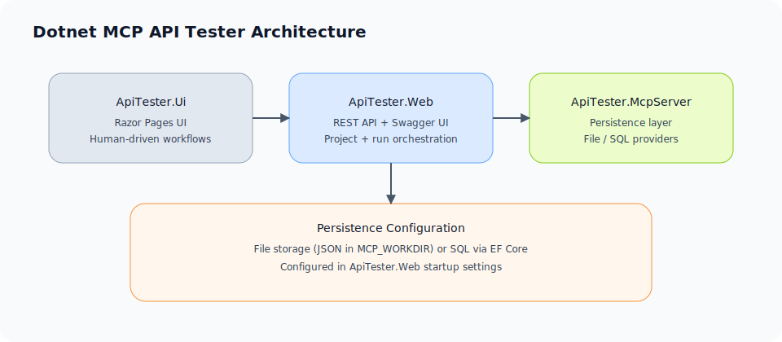

# Dotnet MCP API Tester

## Architecture overview

The solution is split into three main layers:

- **ApiTester.Web**: The ASP.NET Core Web API that handles project CRUD, OpenAPI imports, test-plan generation, and run execution. It exposes a REST API (plus Swagger UI) and is the source of truth for persistence configuration.
- **ApiTester.Ui**: A Razor Pages UI that calls `ApiTester.Web` using an API key. It is intended for human-driven exploration of projects and runs.
- **Persistence layer (ApiTester.McpServer)**: Shared persistence abstractions and implementations. The Web API registers either file-based stores or EF Core-backed SQL stores based on configuration.



## Persistence model

Persistence is selected at startup via the `Persistence` configuration section:

- **File (default)**: Projects, OpenAPI specs, and test plans are stored as JSON in the working directory, while run results are stored as JSON files per project. The working directory comes from `MCP_WORKDIR` (defaults to the current directory).
- **SQL (SqlServer or Sqlite)**: Uses EF Core with the migrations in `ApiTester.McpServer`. All project, spec, test plan, and run data are stored in a database.

### Configure SQL persistence

Set the persistence provider and connection string (for example via environment variables):

```bash
export Persistence__Provider=SqlServer
export Persistence__ConnectionString="Server=localhost;Database=ApiTester;User Id=sa;Password=Your_password123;TrustServerCertificate=true"
```

For SQLite:

```bash
export Persistence__Provider=Sqlite
export Persistence__ConnectionString="Data Source=apitester.db"
```

Apply migrations before first run:

```bash
dotnet ef database update --project ApiTester.McpServer
```

## Local development

```bash
dotnet restore
dotnet build -c Release
dotnet test -c Release
```

## Testing

Run all unit/integration tests:

```bash
dotnet test
```

Run the Playwright E2E suite (UI):

```bash
dotnet build ApiTester.Ui.E2E
pwsh ./ApiTester.Ui.E2E/bin/Debug/net8.0/playwright.ps1 install
dotnet test ApiTester.Ui.E2E/ApiTester.Ui.E2E.csproj
```

In CI, ensure the Playwright browsers are installed before executing the E2E project (the `playwright.ps1 install` step above).

## Local run

One command to start the Web API + UI:

```bash
./scripts/local-run.sh
```

Run them separately (two terminals) if you prefer:

```bash
dotnet run --project ApiTester.Web --launch-profile "ApiTester.Web"
dotnet run --project ApiTester.Ui --launch-profile "ApiTester.Ui"
```

The Web API defaults to `http://localhost:5000` and the UI defaults to `http://localhost:5171`.

## Marketing site assets

The marketing site lives in `ApiTester.Site`. Static assets are stored under `ApiTester.Site/wwwroot/images` (for example `logo-mark.svg`, `hero-illustration.svg`, and `pattern-grid.svg`). Replace those files when updating the logo, hero illustration, or background patterns, and keep references in `ApiTester.Site/Components/App.razor` and the marketing page components in sync with the filenames.

## UI usage

1. Start both the Web API and UI.
2. Navigate to `http://localhost:5171`.
3. Create a project, import an OpenAPI spec, generate test plans, and execute runs.
4. Use the Runs page to review test results and payloads.

The UI sends the API key configured in `ApiTester.Ui/appsettings.json` (`Auth:ApiKey`) to the Web API. Ensure it matches one of the keys configured in `ApiTester.Web` (`Auth:ApiKeys`).

## API authentication

All `/api/*` endpoints require an API key header:

```
X-Api-Key: <your-key>
```

The default dev keys are listed in `ApiTester.Web/appsettings.json`.

## API examples (curl)

Set a couple of helpers:

```bash
export API_BASE_URL=http://localhost:5000
export API_KEY=dev-local-key
```

Health check:

```bash
curl -H "X-Api-Key: $API_KEY" "$API_BASE_URL/health"
```

Version:

```bash
curl -H "X-Api-Key: $API_KEY" "$API_BASE_URL/api/version"
```

List projects:

```bash
curl -H "X-Api-Key: $API_KEY" "$API_BASE_URL/api/projects"
```

Create a project:

```bash
curl -H "X-Api-Key: $API_KEY" \
  -H "Content-Type: application/json" \
  -d '{"name":"Sample Project"}' \
  "$API_BASE_URL/api/projects"
```

Get a project:

```bash
curl -H "X-Api-Key: $API_KEY" "$API_BASE_URL/api/projects/<projectId>"
```

Import an OpenAPI spec (JSON file upload):

```bash
curl -H "X-Api-Key: $API_KEY" \
  -F "file=@./openapi.json" \
  "$API_BASE_URL/api/projects/<projectId>/openapi/import"
```

Get OpenAPI metadata:

```bash
curl -H "X-Api-Key: $API_KEY" "$API_BASE_URL/api/projects/<projectId>/openapi"
```

Generate a test plan:

```bash
curl -H "X-Api-Key: $API_KEY" \
  -X POST \
  "$API_BASE_URL/api/projects/<projectId>/testplans/<operationId>/generate"
```

Fetch a test plan:

```bash
curl -H "X-Api-Key: $API_KEY" \
  "$API_BASE_URL/api/projects/<projectId>/testplans/<operationId>"
```

Execute a run:

```bash
curl -H "X-Api-Key: $API_KEY" \
  -X POST \
  "$API_BASE_URL/api/projects/<projectId>/runs/execute/<operationId>"
```

List runs:

```bash
curl -H "X-Api-Key: $API_KEY" \
  "$API_BASE_URL/api/runs?projectKey=<projectKey>"
```

Get a run:

```bash
curl -H "X-Api-Key: $API_KEY" \
  "$API_BASE_URL/api/runs/<runId>"
```


## Deployment and release operations

For production packaging and release hardening guidance, see:

- `docs/deployment.md`
- `docs/release-checklist.md`

## Troubleshooting

### API fails to start with an API key error

If you see `API key authentication requires at least one key`, configure at least one key under `Auth:ApiKey` or `Auth:ApiKeys` for the Web API (and UI).

### UI shows 401/403 when calling the API

Ensure `ApiTester.Ui/appsettings.json` has an `Auth:ApiKey` value that matches one of the keys in `ApiTester.Web/appsettings.json`. Also verify `ApiTesterWeb:BaseUrl` matches where the Web API is running.

### SQL provider config mismatch

If you set a SQL connection string but the service still uses file persistence, confirm you set `Persistence:Provider` **and** `Persistence:ConnectionString`. The persistence layer does not read `ConnectionStrings:ApiTester` for selection, so mismatched keys will silently fall back to file storage.

### EF Core migrations missing tables

If the app fails on SQL queries, run the migrations:

```bash
dotnet ef database update --project ApiTester.McpServer
```

## Smoke test

With the Web API + UI running:

```bash
./scripts/smoke-test.sh
```
