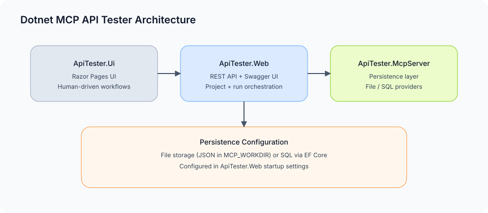

# Dotnet MCP API Tester

**Give your coding agent an API test engineer.**

Dotnet MCP API Tester is an MCP-native, .NET API qualification tool for Claude, Codex, and other MCP-capable agents. Give it an OpenAPI contract and it can understand the API structure, derive deterministic boundary tests, ground AI reasoning against the real contract, execute only policy-approved requests, and return evidence that a coding agent can use during development.

It can also be used through the existing REST API and Razor Pages UI, but the most interesting workflow is as a reusable MCP capability inside the development loop.

> The contract decides what is true, deterministic code decides what is mechanically testable and safe, and the LLM handles the reasoning that remains.

## Why this exists

Coding agents are already very good at reading code and proposing changes. API testing is different: an agent also needs a trustworthy description of the external contract, a systematic way to generate edge cases, a controlled way to execute requests, and evidence from the real service.

Without a dedicated tool, every repository tends to reinvent this with prompts, ad-hoc `curl` commands, bespoke scripts, or hand-written test cases.

Dotnet MCP API Tester turns that into a reusable capability:

```text
change API code
      |
      v
Claude / Codex / MCP client
      |
      | MCP
      v
Dotnet MCP API Tester
      |
      +--> import OpenAPI
      +--> understand operations / schemas / security
      +--> derive deterministic boundary tests
      +--> retrieve grounded API evidence
      +--> use AI for semantic reasoning
      +--> dry-run and execute policy-approved requests
      +--> compare observed behaviour with the contract
      |
      v
findings / evidence
      |
      v
coding agent fixes code -> retest
```

The goal is not to give an LLM unrestricted network access. The goal is to give an agent a **specialised, constrained API qualification capability**.

## What makes it different

This project deliberately separates things that can be known exactly from things where AI adds value.

### Deterministic contract analysis

OpenAPI is the source of truth. The deterministic test generator derives cases directly from documented constraints, including:

- required and optional parameters;
- path, query and header parameters;
- numeric minimum/maximum and just-inside / just-outside boundaries;
- `int32` and `int64` extremes;
- enums, invalid values and casing variants;
- `minLength` / `maxLength`;
- `minItems` / `maxItems`;
- nullable values;
- regular-expression patterns;
- UUID, email, URI, date and date-time formats;
- required request bodies and required object properties;
- referenced component schemas.

If OpenAPI says an integer has a maximum of `9999`, the system does not need an LLM to decide that `10000` is an edge case.

### Structured RAG instead of arbitrary text chunks

OpenAPI is structured domain data, not prose. The RAG path therefore builds evidence units around:

- operations;
- component schemas;
- security schemes.

An operation chunk keeps the method, path, parameters, request body, security and documented responses together. This gives retrieval a much cleaner evidence boundary than slicing a JSON document at arbitrary character offsets.

### Grounded AI reasoning

Azure OpenAI can then reason over the retrieved evidence for questions that are not purely mechanical, for example:

- What are the important failure modes for this operation?
- What should a developer be careful about when integrating with this API?
- Which documented authentication requirements apply here?
- Which additional semantic test scenarios are worth considering?

Retrieved API documentation is treated as **untrusted data**, not instructions. The model is told not to invent undocumented endpoints, parameters, authentication, status codes or behaviour.

### Deterministic execution policy

The model is not the authority boundary.

Execution is controlled by application policy, including:

- dry-run mode;
- allowed HTTP methods;
- allowed base URLs;
- localhost/private-network controls;
- SSRF protection;
- request/response size limits;
- timeouts;
- process-level gating of MCP policy mutation.

An agent can propose an action, but deterministic application policy decides whether it is allowed to happen.

## Why MCP

MCP makes the tester a reusable capability rather than another application developers have to manually drive.

An MCP-capable coding agent can compose API testing with its normal repository work. For example:

```text
"I changed the customer endpoint.
Use the API Tester MCP server to qualify it,
run the safe edge cases,
compare the behaviour with OpenAPI,
and tell me what still looks wrong."
```

The coding agent remains responsible for understanding and changing the codebase. Dotnet MCP API Tester specialises in understanding and exercising the API boundary.

That makes it useful for:

- feature development;
- pre-PR qualification;
- regression testing after API changes;
- validating third-party APIs against their published contract;
- onboarding developers to unfamiliar APIs;
- checking whether runtime behaviour still matches OpenAPI;
- investigating API failures with grounded AI assistance;
- agent-driven development loops where test evidence feeds directly back into implementation.

## MCP development-loop example

A typical workflow looks like this:

```text
feature branch
   |
build + unit tests
   |
start service
   |
API Tester MCP
   |
import / refresh OpenAPI
   |
deterministic contract-derived cases
   |
AI-assisted semantic analysis
   |
dry-run safety review
   |
permitted live requests
   |
contract + behaviour report
   |
agent fixes failures
   |
retest
```

The same model can later be used as a CI/pre-merge qualification step without making the LLM the source of truth.

## MCP quick start

The MCP server is a stdio .NET process:

```bash
dotnet run --project ApiTester.McpServer
```

Configure your MCP client to launch that command from the repository directory. MCP clients differ in configuration syntax, but conceptually the registration is:

```text
command: dotnet
args: run --project /absolute/path/to/dotnet-mcp-api-tester/ApiTester.McpServer
```

For Codex, a local `config.toml` entry can look like:

```toml
[mcp_servers.api_tester]
command = "dotnet"
args = ["run", "--project", "/ABSOLUTE/PATH/dotnet-mcp-api-tester/ApiTester.McpServer"]
```

Then ask the agent to use the API Tester tools to create/select a project, import an OpenAPI document, inspect operations, generate deterministic plans, index structured evidence, ask grounded questions, inspect execution policy, dry-run calls and execute only explicitly permitted requests.

See [`docs/mcp-agent-workflow.md`](docs/mcp-agent-workflow.md) for a fuller development-loop example and safety model.

## Example agent request

```text
Use the API Tester MCP server to qualify this API.

1. Create a project for the API.
2. Import its OpenAPI document.
3. Show me the operations and important constraints.
4. Generate deterministic edge cases from the contract.
5. Index the API for grounded RAG.
6. Explain the important integration and failure scenarios using only retrieved evidence.
7. Show the execution policy before calling anything.
8. Dry-run representative requests first.
9. Ask before enabling live execution.
10. Execute only the small set of approved cases.
11. Compare actual responses with the documented contract.
12. Summarise deterministic findings separately from AI reasoning.
```

## AI and Azure

The project supports a real Azure OpenAI path for chat and embeddings, while retaining explicit local/offline fallbacks.

The Azure path includes:

- Azure OpenAI v1 HTTP integration;
- Azure chat deployment;
- Azure embedding deployment;
- keyless Microsoft Entra authentication;
- explicit Azure CLI / Managed Identity / default credential-chain selection;
- API-key fallback where intentionally configured;
- cancellation;
- bounded retries and `Retry-After` handling;
- timeouts;
- response-size limits;
- circuit breaking;
- request-ID-safe diagnostics;
- Activity-based observability;
- batched embeddings for larger contracts.

For local Azure development, prefer an authenticated Azure CLI identity. For Azure-hosted production, prefer Managed Identity. Do not commit access tokens, API keys or client secrets.

See [`docs/azure-openai.md`](docs/azure-openai.md) for configuration details.

## Safety model

The important design principle is:

> **Agent intent is not authority.**

The MCP agent cannot create new network authority merely by asking for it. Runtime execution remains behind deterministic controls.

Policy mutation through MCP is disabled by default. If an explicitly supervised local workflow needs the agent to adjust policy, that capability must be enabled before the MCP process starts.

This allows teams to expose useful testing capabilities without turning the coding agent into an unrestricted HTTP client.

## Who this is for

- **Backend/API engineers** who want an agent to qualify APIs as part of normal development.
- **QA/test engineers** who want contract-derived edge cases plus reproducible execution evidence.
- **AI-assisted development teams** using Claude, Codex or other MCP-capable coding agents.
- **Platform/DevOps teams** looking for a reusable API quality gate for local development and CI.
- **Technical leads** who want the AI reasoning layer separated from deterministic truth and safety controls.
- **Teams integrating third-party APIs** who need a fast way to understand, test and document an unfamiliar contract.

## Key capabilities at a glance

- Import and version OpenAPI specs per project.
- List and describe API operations, including contracts without explicit `operationId` values.
- Generate constraint-driven deterministic API test plans.
- Build structured operation/schema/security evidence for RAG.
- Use Azure embeddings and grounded chat without silently treating AI output as contract truth.
- Execute dry-run and live requests through explicit safety policy.
- Run and inspect detailed test results.
- Manage projects and runs through MCP, REST endpoints and a Razor Pages UI.
- Choose between local file storage and EF Core-backed SQL persistence.

## Traditional Web/UI workflow

MCP is the primary agent-oriented workflow, but the repository also contains a conventional API and UI:

- **ApiTester.McpServer**: MCP tools, OpenAPI analysis, deterministic test generation, structured RAG, execution policy and shared persistence services.
- **ApiTester.Web**: ASP.NET Core Web API for project CRUD, imports, test-plan generation and run execution.
- **ApiTester.Ui**: Razor Pages UI for human-driven exploration of projects and runs.
- **ApiTester.Rag**: provider-neutral RAG abstractions, indexing, retrieval and grounding.
- **ApiTester.AI**: model/provider transport and Azure OpenAI integration.



## Persistence model

Persistence is selected at startup via the `Persistence` configuration section:

- **File (default)**: Projects, OpenAPI specs, and test plans are stored as JSON in the working directory, while run results are stored as JSON files per project. The working directory comes from `MCP_WORKDIR` (defaults to the current directory).
- **SQL (SqlServer or Sqlite)**: Uses EF Core with the migrations in `ApiTester.McpServer`. All project, spec, test plan, and run data are stored in a database.

### Configure SQL persistence

Set the persistence provider and connection string (for example via environment variables):

```bash
export Persistence__Provider=SqlServer
export Persistence__ConnectionString="Server=localhost;Database=ApiTester;User Id=sa;Password=Your_password123;TrustServerCertificate=true"
```

For SQLite:

```bash
export Persistence__Provider=Sqlite
export Persistence__ConnectionString="Data Source=apitester.db"
```

Apply migrations before first run:

```bash
dotnet ef database update --project ApiTester.McpServer
```

## Local development

```bash
dotnet restore
dotnet build -c Release
dotnet test -c Release
```

## Testing

Run all unit/integration tests:

```bash
dotnet test
```

Run the security regression suite only:

```bash
./scripts/security.sh
```

Windows:

```powershell
pwsh ./scripts/security.ps1
```

Run the docker-compose golden path E2E suite:

```bash
./scripts/e2e.sh
```

Windows:

```powershell
pwsh ./scripts/e2e.ps1
```

Manual QA runbook and fixture data are documented in:
- `docs/qa/golden-path.md`
- `docs/qa/test-data.md`

Security docs and threat modeling resources:
- `docs/security/README.md`
- `docs/security/threat-model.md`
- `SECURITY.md`

## Local Web/UI run

One command to start the Web API + UI:

```bash
./scripts/local-run.sh
```

Run them separately (two terminals) if you prefer:

```bash
dotnet run --project ApiTester.Web --launch-profile "ApiTester.Web"
dotnet run --project ApiTester.Ui --launch-profile "ApiTester.Ui"
```

The Web API defaults to `http://localhost:5000` and the UI defaults to `http://localhost:5171`.

## UI usage

1. Start both the Web API and UI.
2. Navigate to `http://localhost:5171`.
3. Create a project, import an OpenAPI spec, generate test plans, and execute runs.
4. Use the Runs page to review test results and payloads.

The UI sends the API key configured in `ApiTester.Ui/appsettings.json` (`Auth:ApiKey`) to the Web API. Ensure it matches one of the keys configured in `ApiTester.Web` (`Auth:ApiKeys`).

## API authentication

All `/api/*` endpoints require an API key header:

```text
X-Api-Key: <your-key>
```

The default dev keys are listed in `ApiTester.Web/appsettings.json`.

## API examples (curl)

Set helpers:

```bash
export API_BASE_URL=http://localhost:5000
export API_KEY=dev-local-key
```

Health check:

```bash
curl -H "X-Api-Key: $API_KEY" "$API_BASE_URL/health"
```

Create a project:

```bash
curl -H "X-Api-Key: $API_KEY" \
  -H "Content-Type: application/json" \
  -d '{"name":"Sample Project"}' \
  "$API_BASE_URL/api/projects"
```

Import an OpenAPI spec:

```bash
curl -H "X-Api-Key: $API_KEY" \
  -F "file=@./openapi.json" \
  "$API_BASE_URL/api/projects/<projectId>/openapi/import"
```

Generate a test plan:

```bash
curl -H "X-Api-Key: $API_KEY" \
  -X POST \
  "$API_BASE_URL/api/projects/<projectId>/testplans/<operationId>/generate"
```

Execute a run:

```bash
curl -H "X-Api-Key: $API_KEY" \
  -X POST \
  "$API_BASE_URL/api/projects/<projectId>/runs/execute/<operationId>"
```

## Open-source direction

The project is intended to remain useful as a standalone developer tool rather than being tied to a particular coding agent or model provider.

Good future contributions include:

- packaged MCP installation/distribution;
- Docker-based one-command agent setup;
- richer OpenAPI 3.1 support;
- selective indexing for extremely large API estates;
- additional embedding/model providers behind the existing abstractions;
- durable production vector stores;
- CI/pre-PR qualification commands;
- richer semantic/business test generation;
- SARIF/JUnit/Markdown qualification reports;
- contract-diff-driven retesting;
- configurable approval workflows for live execution;
- reusable policy profiles for local/dev/staging environments.

See [`docs/mcp-agent-workflow.md`](docs/mcp-agent-workflow.md) for the agent-development vision.

## Deployment and release operations

For production packaging and release hardening guidance, see:

- `docs/deployment.md`
- `docs/release-checklist.md`

## Troubleshooting

### MCP client starts but no tools appear

Confirm the configured command launches `ApiTester.McpServer` from an absolute path and that the process writes protocol messages to stdout without application logging corrupting the stdio stream.

### Azure AI falls back to local/offline clients

Check that the Azure endpoint, chat deployment, embedding deployment and intended authentication mode are fully configured. The application logs whether Azure or fallback clients were selected.

### API fails to start with an API key error

If you see `API key authentication requires at least one key`, configure at least one key under `Auth:ApiKey` or `Auth:ApiKeys` for the Web API and UI.

### UI shows 401/403 when calling the API

Ensure `ApiTester.Ui/appsettings.json` has an `Auth:ApiKey` value that matches one of the keys in `ApiTester.Web` (`Auth:ApiKeys`). Also verify `ApiTesterWeb:BaseUrl` matches where the Web API is running.

### SQL provider config mismatch

If you set a SQL connection string but the service still uses file persistence, confirm you set `Persistence:Provider` **and** `Persistence:ConnectionString`.

### EF Core migrations missing tables

```bash
dotnet ef database update --project ApiTester.McpServer
```

## Smoke test

With the Web API + UI running:

```bash
./scripts/smoke-test.sh
```
